# Node

[Instalar última versão](https://nodejs.org/en/download)
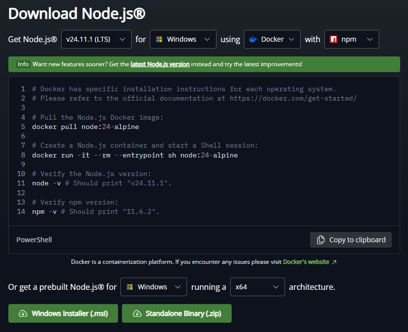

# Angular
Abra um terminal e digite o comando
```
npm install -g @angular/cli
```

# Extensões para o Visual Studio Code
* GitHub Copilot
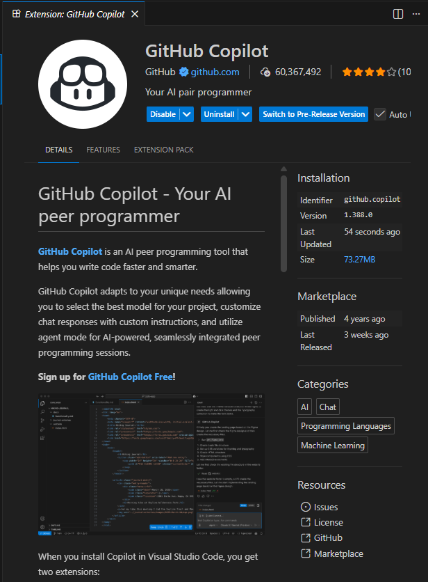
* GitHub Copilot Chat
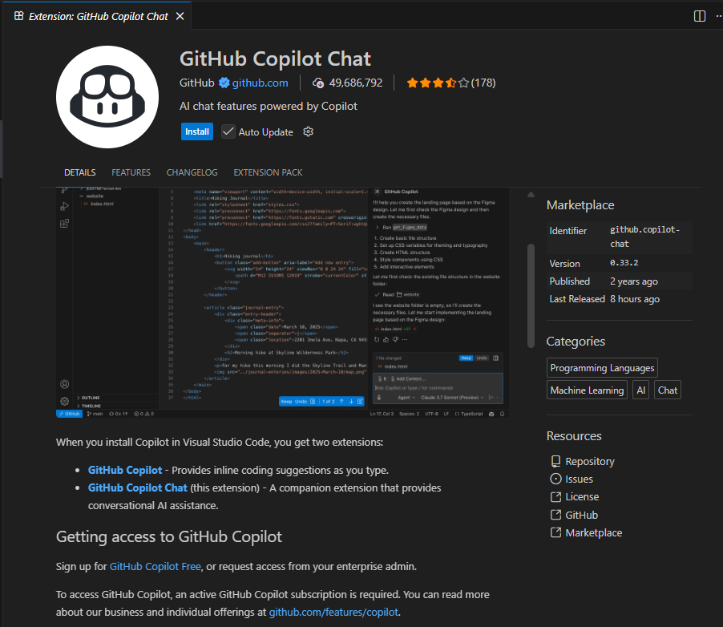
* GitHub Actions
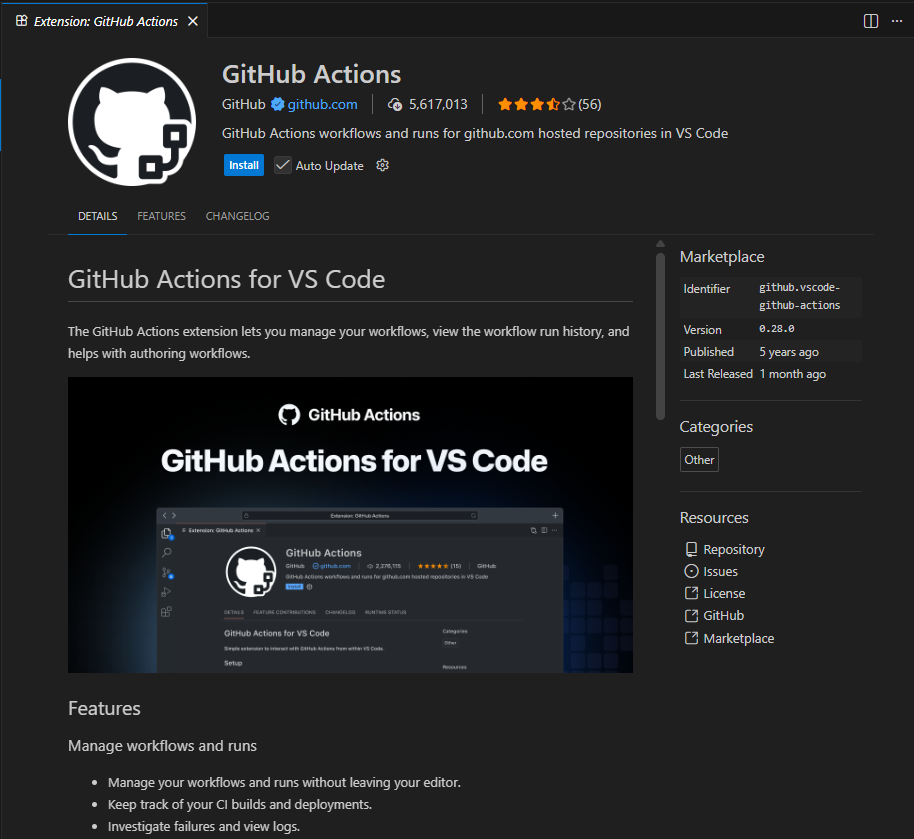
* GitHub Pull Requests
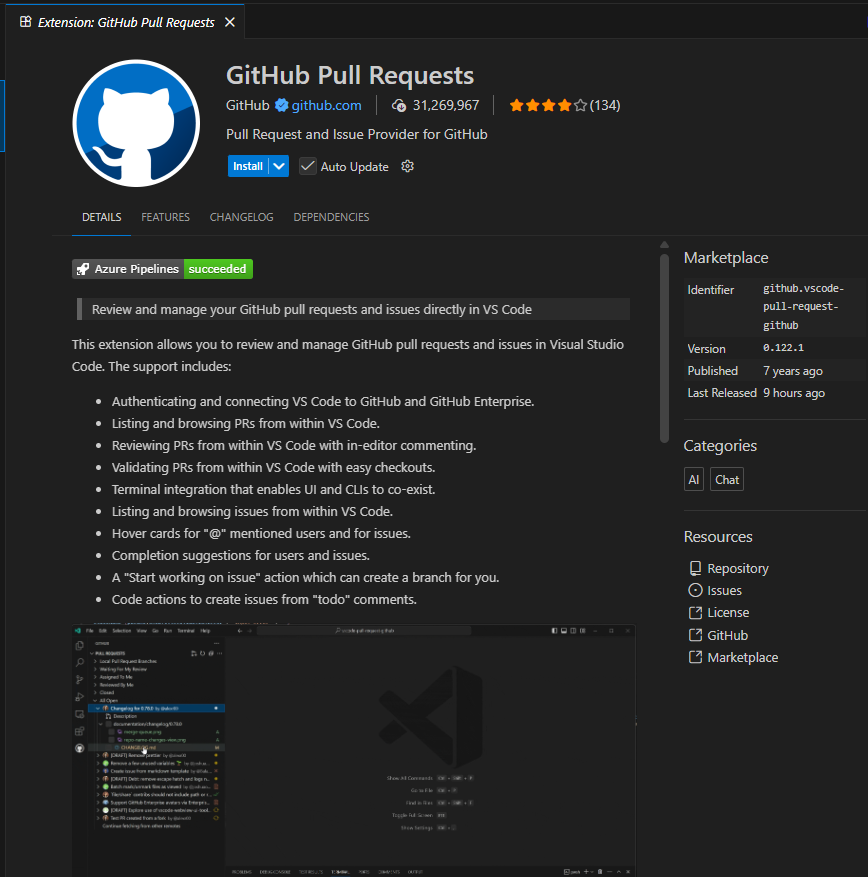
* GitLens — Git supercharged
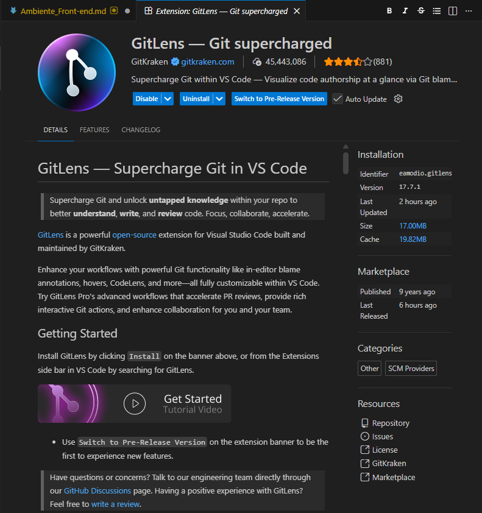
* Angular Language Service
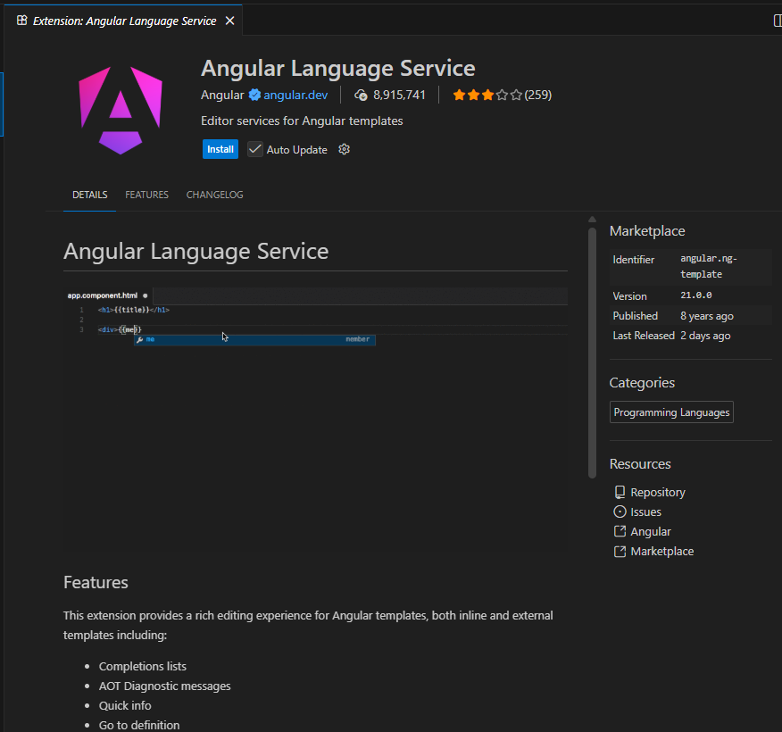
* Error Lens
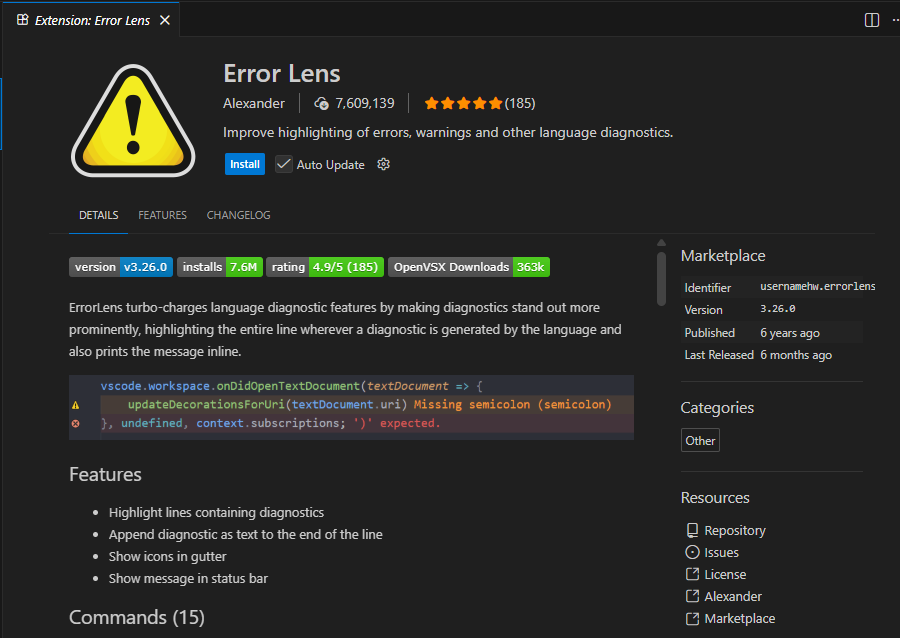
* ESLint da Microsoft
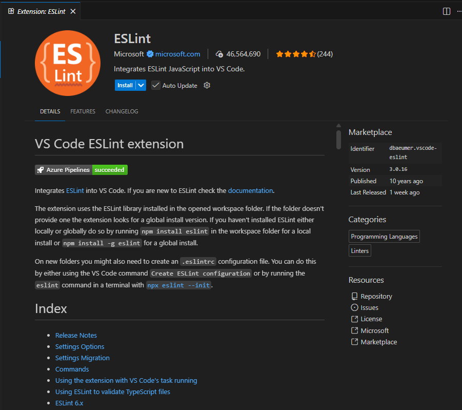
* Pretty TypeScript Errors
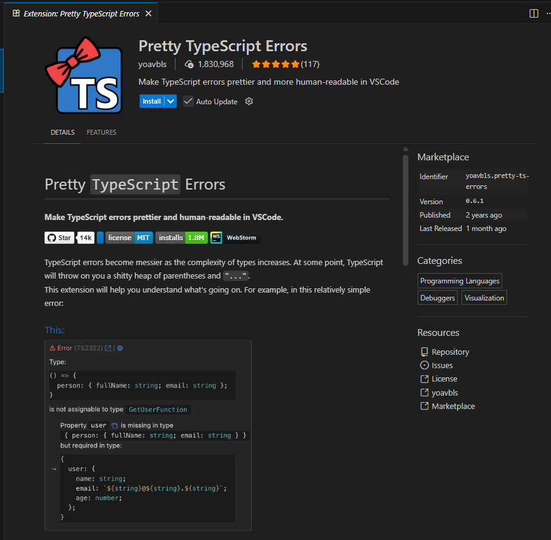
* SonarQube for IDE
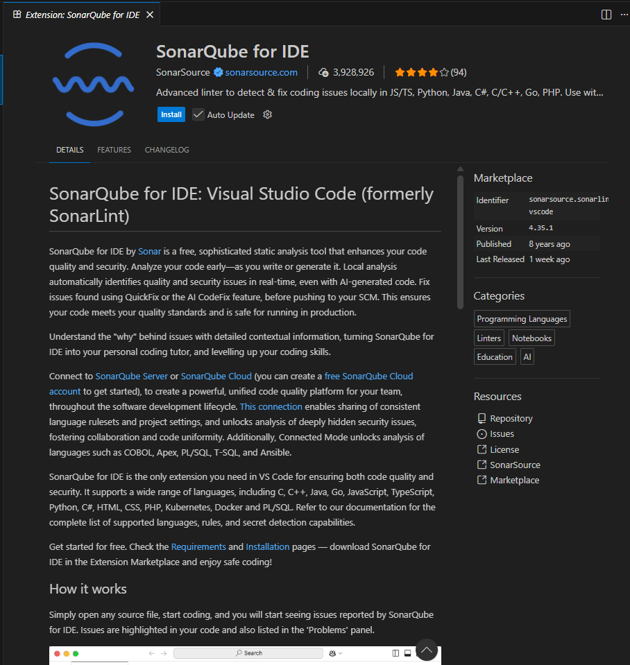
No final da Instalação Confiar o certificado
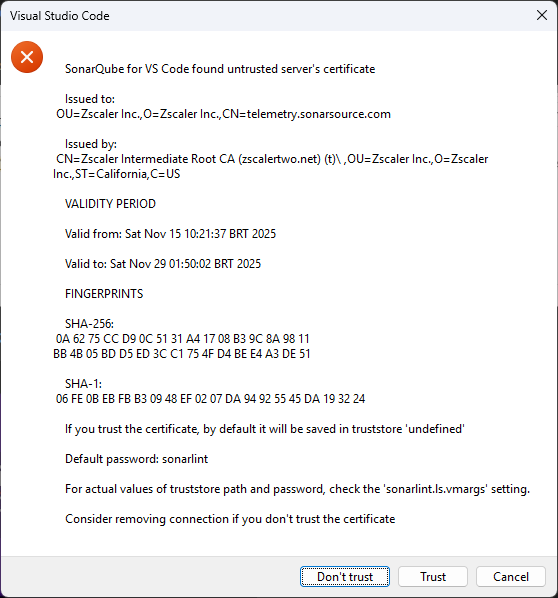
